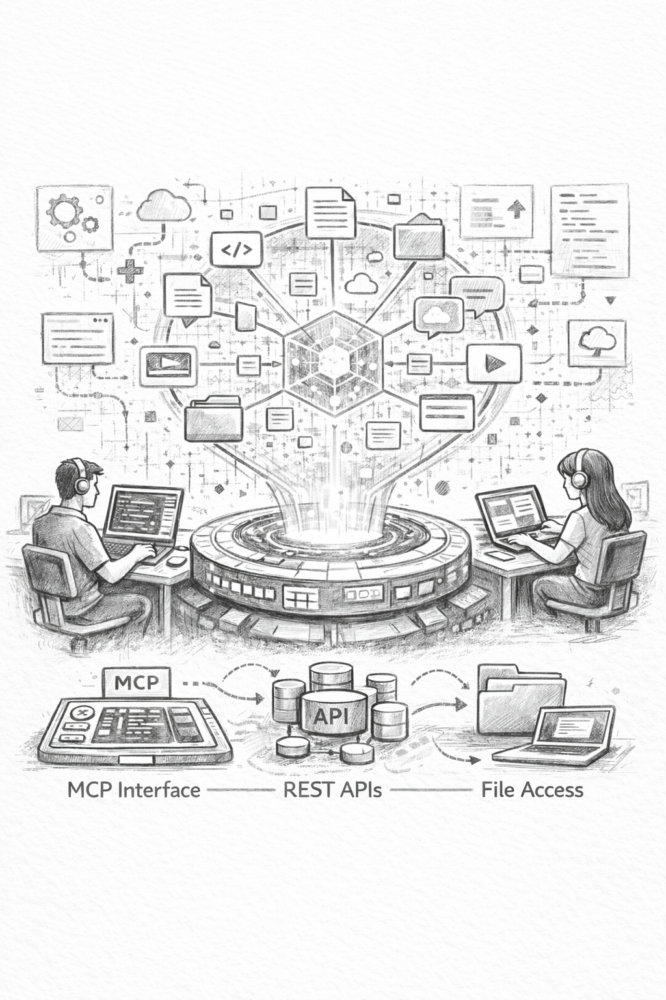

# Fold



Ever wanted to share memory so your agents and clients stay in sync? Share it as a team, or just for yourself? Keep a record of decisions, a knowledge base, anything worth remembering?

That is what Fold does. It consumes knowledge, information, text, files, code and creates a vector-based holographic memory store. Your agents and clients access it via MCP, REST APIs, or directly as files on the filesystem. Fold keeps everything synchronised and listens for changes in your repositories to update automatically in the background.

**A semantic memory layer for teams and AI agents.**

Fold captures, organises and retrieves project knowledge across your codebase. It stores decisions, sessions, code patterns and team context so you (and AI agents) can find the right information when you need it.

Built on principles from neuroscience, Fold reconstructs full context from fragments. Ask a natural language question and receive relevant code, decisions, past solutions and team insights.

## Information for Agents

Claude Code skills for working with Fold:

- **[using-fold](./skills/using-fold/SKILL.md)**: Query memories, store context, search codebases
- **[managing-fold](./skills/managing-fold/SKILL.md)**: Deploy, configure and operate Fold instances

**Install skills** (copy to `~/.claude/skills/`):

```bash
# Download using-fold skill
curl -o ~/.claude/skills/using-fold/SKILL.md --create-dirs \
  https://raw.githubusercontent.com/Generation-One/fold/main/skills/using-fold/SKILL.md

# Download managing-fold skill
curl -o ~/.claude/skills/managing-fold/SKILL.md --create-dirs \
  https://raw.githubusercontent.com/Generation-One/fold/main/skills/managing-fold/SKILL.md
```

**Latest docs**: Always check the [Fold Wiki](https://github.com/Generation-One/fold/wiki) for current API references and configuration options.

## Quick Links

**Documentation**: [Fold Wiki](https://github.com/Generation-One/fold/wiki)

- [Overview & Concepts](https://github.com/Generation-One/fold/wiki/Overview-Concepts): what Fold does and why it matters
- [Getting Started](https://github.com/Generation-One/fold/wiki/Getting-Started): install and run in five minutes
- [Configuration](https://github.com/Generation-One/fold/wiki/Configuration): auth, LLM providers, git integration
- [API Reference](https://github.com/Generation-One/fold/wiki/API-Reference): complete REST API documentation
- [MCP Tools](https://github.com/Generation-One/fold/wiki/MCP-Tools-Reference): use Fold with Claude Code and other AI agents
- [Deployment & Operations](https://github.com/Generation-One/fold/wiki/Deployment-Operations): production setup and scaling
- [Troubleshooting](https://github.com/Generation-One/fold/wiki/Troubleshooting-FAQ): common issues and solutions

## How It Works

```
Your Codebase + Team Activity + AI Context
                    ↓
         Semantic Indexing (LLM-powered)
                    ↓
        Vector Database + Knowledge Graph
                    ↓
      Natural Language Search & Retrieval
                    ↓
        Claude / Cursor / Your AI Agent
```

Fold stores:

- **Codebase memories**: auto-indexed source files
- **Session notes**: 'we fixed the login bug and here is how'
- **Decisions**: 'we chose Redis for caching because...'
- **Specs**: feature requirements and technical specifications
- **Commit summaries**: AI-generated summaries of git activity
- **Team insights**: who changed what, when and why

All memories are semantically indexed and linked in a knowledge graph. This enables:

- **Holographic retrieval**: any fragment reconstructs full context
- **Semantic search**: find meaning, not keywords
- **AI-ready**: Claude, Cursor and other agents query Fold via MCP
- **Zero friction**: works with existing git repos; no workflow changes
- **Automatic indexing**: git integration indexes your repos on push

## Use Cases

### For Developers

'How does authentication work?' returns code, decisions and sessions. 'Show me export patterns' finds similar implementations across projects. 'What changed in the payment service?' surfaces all commits, decisions and related code.

### For AI Agents

Claude understands your architecture without reading raw files. It implements features matching your patterns and conventions, respects architectural decisions automatically, and makes informed cross-service changes.

### For Teams

Institutional memory survives team turnover. Decisions are discoverable, not scattered across Slack. Junior developers onboard faster with full context. Multiple projects stay synchronised.

## Quick Start

```bash
# Clone
git clone https://github.com/Generation-One/fold.git
cd fold

# Start (requires Docker)
docker-compose up -d

# Create admin
curl -X POST http://localhost:8765/auth/bootstrap \
  -H "Content-Type: application/json" \
  -d '{"token": "your-token"}'

# Access at http://localhost:8765
```

See [Getting Started](https://github.com/Generation-One/fold/wiki/Getting-Started) for detailed instructions.

## Tech Stack

- **Rust** + Axum (web framework)
- **SQLite** (metadata storage)
- **Qdrant** (vector database)
- **fastembed** (local embeddings) or cloud LLM APIs
- **Docker** for deployment

## Key Features

| Feature | Description |
|---------|-------------|
| Holographic Retrieval | Any fragment of knowledge reconstructs full context |
| Semantic Search | Find by meaning, not keywords |
| Knowledge Graph | Memories linked by relationships (modifies, implements, decides) |
| Git Integration | Auto-index GitHub/GitLab; webhooks keep memories in sync |
| AI-Ready (MCP) | Works with Claude Code, Cursor, Windsurf and other agents |
| Multi-Provider LLM | Gemini, OpenRouter, OpenAI with automatic fallback |
| Self-Hosted | Full control; embeddings run locally without external APIs |

## Why 'Fold'?

Like a fold in spacetime, Fold brings distant but related knowledge close together. Any fragment of your project knowledge can reconstruct the whole picture.

## Licence

MIT
